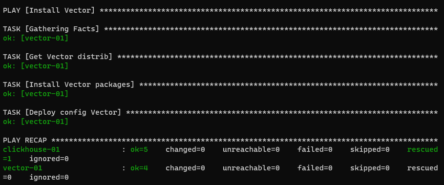

# Задание 08-ansible-02-playbook

## Подготовка к выполнению

1. Создайте свой собственный (или используйте старый) публичный репозиторий на github с произвольным именем.
2. Скачайте [playbook](08-ansible-02-playbook/playbook) из репозитория с домашним заданием и перенесите его в свой репозиторий.
3. Подготовьте хосты в соответствии с группами из предподготовленного playbook.

## Основная часть

1. Приготовьте свой собственный inventory файл `prod.yml`.
2. Допишите playbook: нужно сделать ещё один play, который устанавливает и настраивает [vector](https://vector.dev).
3. При создании tasks рекомендую использовать модули: `get_url`, `template`, `unarchive`, `file`.
4. Tasks должны: скачать нужной версии дистрибутив, выполнить распаковку в выбранную директорию, установить vector.
5. Запустите `ansible-lint site.yml` и исправьте ошибки, если они есть.
6. Попробуйте запустить playbook на этом окружении с флагом `--check`.
7. Запустите playbook на `prod.yml` окружении с флагом `--diff`. Убедитесь, что изменения на системе произведены.
8. Повторно запустите playbook с флагом `--diff` и убедитесь, что playbook идемпотентен.
9. Подготовьте README.md файл по своему playbook. В нём должно быть описано: что делает playbook, какие у него есть параметры и теги.
10. Готовый playbook выложите в свой репозиторий, поставьте тег `08-ansible-02-playbook` на фиксирующий коммит, в ответ предоставьте ссылку на него.

### Ответ

- Подготовил новый [репозиторий](https://github.com/danilabar/08-ansible-02-playbook) (этот)
- Подготовил виртуальную машину с CentOS 7
- Добавил в inventory файл [prod.yml](inventory/test.yml) IP-адрес машины c CentOS
- В плейбуке [site.yml](site_old.yml) добавил новый play который скачивает, устанавливает и настраивает vector
    ```yaml
    - name: Install Vector
      hosts: vector
      handlers:
      - name: Start Vector service
        become: true
        ansible.builtin.service:
          name: vector
          state: restarted
    
      tasks:
        - name: Get Vector distrib
          ansible.builtin.get_url:
            url: "https://packages.timber.io/vector/0.21.1/vector-0.21.1-1.{{ ansible_architecture }}.rpm"
            dest: "./vector-0.21.1-1.{{ ansible_architecture }}.rpm"
    
        - name: Install Vector packages
          become: true
          ansible.builtin.yum:
            name: vector-0.21.1-1.{{ ansible_architecture }}.rpm
          notify: Start Vector service
    
        - name: Deploy config Vector
          template:
            src: vector.j2
            dest: /etc/vector/vector.toml
            mode: 0755
          notify: Start Vector service
    ```
  - Архитектура выбирается на основании фактов о машине `ansible_architecture`
- Запустил `ansible-lint site.yml`  
      
- Исправил ошибки `site.yml`  
      
- Запустил плейбук с флагом `--check`. Он завершился с ошибкой т.к. нет скаченных артефактов по которым он мог бы 
выполнить проверку сценараия  
      
- Запустил playbook на `prod.yml` окружении с флагом `--diff`  
    
    
      
  - Изменения на системе произведены  
      
- Повторно запустил playbook с флагом `--diff` - playbook идемпотентен  
    
      
- Добавил некоторые пояснительные комментарии в самом плейбуке [site.yml](site_old.yml)

---

# Задание 08-ansible-03-yandex

## Подготовка к выполнению

1. Подготовьте в Yandex Cloud три хоста: для `clickhouse`, для `vector` и для `lighthouse`.

## Основная часть

1. Допишите playbook: нужно сделать ещё один play, который устанавливает и настраивает lighthouse.
2. При создании tasks рекомендую использовать модули: `get_url`, `template`, `yum`, `apt`.
3. Tasks должны: скачать статику lighthouse, установить nginx или любой другой webserver, настроить его конфиг для открытия lighthouse, запустить webserver.
4. Приготовьте свой собственный inventory файл `prod.yml`.
5. Запустите `ansible-lint site.yml` и исправьте ошибки, если они есть.
6. Попробуйте запустить playbook на этом окружении с флагом `--check`.
7. Запустите playbook на `prod.yml` окружении с флагом `--diff`. Убедитесь, что изменения на системе произведены.
8. Повторно запустите playbook с флагом `--diff` и убедитесь, что playbook идемпотентен.
9. Подготовьте README.md файл по своему playbook. В нём должно быть описано: что делает playbook, какие у него есть параметры и теги.
10. Готовый playbook выложите в свой репозиторий, поставьте тег `08-ansible-03-yandex` на фиксирующий коммит, в ответ предоставьте ссылку на него.

### Ответ

- В плейбук [site.yml](site_old.yml) добавлен play, который устанавливает и настраивает lighthouse
- Дописаны [конфигурационные файлы](templates) для настройки сервисов 
- Созданы необходимые [group_vars](group_vars)
- Некоторые подробности по задачам в плейбуке отмечены комментариями
- Инвентори `prod.yaml` собирает [terraform](terraform/inventory.tf) в процессе инициализации инфраструктуры
- Запуск плейбука [site.yml](site_old.yml) происходит автоматически из [terraform](terraform/ansible.tf) после деплоя машин и формирования инвентори
- Для того что бы запустить создание и настройку машин необходимо:
  - Получить токен и поместить его в `env`
    ```bash
    export YC_TOKEN=`yc iam create-token`
    ```
  - Перейти в каталог с terraform, запустить `init` и `apply` 
    ```bash
    terraform init
    terraform apply -auto-approve
    ```
      
      
    - В конце будет получена строка для подключения к lighthouse `http://51.250.75.114/#http://51.250.78.207:8123/?user=netology`. 
    Можно выполнить подключение и увидеть записанные данные в БД. Логин/пароль netology/netology
    
  - Для удаления созданных ресурсов запустить
    ```bash
    terraform destroy -auto-approve
    ```